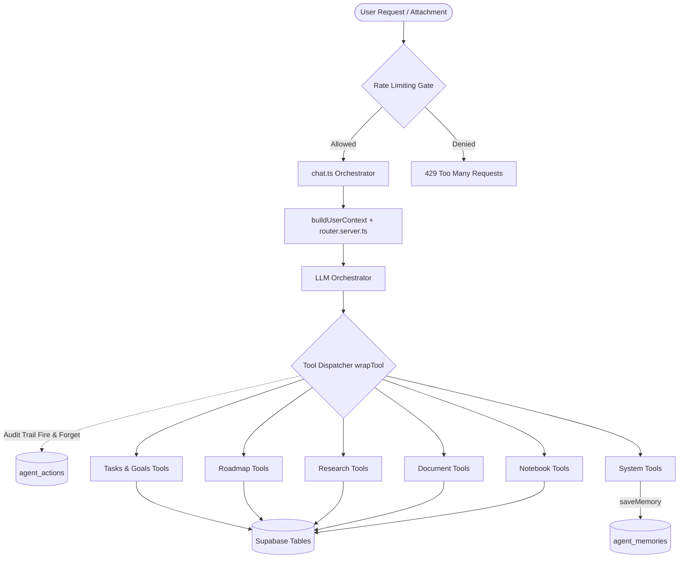

# Remispace — Your Gentle Guide & AI Learning Companion

[](https://react.dev/)
[](https://tanstack.com/router)
[](https://vitejs.dev/)
[](https://tailwindcss.com/)
[](https://supabase.com/)
[](https://sdk.vercel.ai/)

**Remispace** is a calm, slow-productivity workspace and intelligent AI-powered learning companion. It is designed to replace fragmented tools, aggressive notification loops, and productivity overwhelm with a tranquil environment where notes, habits, goals, focus, and deep learning live harmoniously together.

The main codebase and documentation can be found in the [`Remainderr/`](./Remainderr) directory.

---

## 💡 Why Remispace is Useful

### 1. Slow Productivity Over Anxiety
Traditional productivity apps rely on aggressive red badge counters, streak-shaming, and endless notification loops that cause burnout. Remispace is built on the philosophy of **slow, steady progress**. It celebrates incremental effort, provides guilt-free restarts when life gets busy, and offers a quiet, glassmorphic interface that reduces cognitive fatigue.

### 2. Unified Learning & Execution Hub
Most learners struggle because their learning materials (videos, PDFs, notes) are disconnected from their execution systems (tasks, habits, calendars). Remispace bridges this gap by embedding AI-generated study roadmaps, document tutors, and notes directly alongside your daily habits, goal milestones, and focus timers.

### 3. Truthful, Confabulation-Free AI Assistance
Standard AI assistants often hallucinate plausible-sounding answers or guess when faced with novel terms, current events, or niche concepts. Remispace includes an intelligent **Search-Routing & Confabulation-Prevention Policy** that evaluates queries across 7 cognitive dimensions. It senses when information needs real-world verification and automatically searches the web *before* answering, ensuring reliable, grounded guidance.

---

## 🌟 Detailed Feature Guide

### 🤖 Remi — Multi-Agent AI Learning Coach
Remi isn't just a generic chatbot; it is a coordinated team of specialized AI agents designed to support every phase of your learning journey:

- **Custom Study Roadmaps**: Give Remi any topic (e.g., *"Quantum Computing Fundamentals"*, *"System Design for Web Developers"*, or *"Automotive Harness Engineering"*), and it builds a multi-phase learning roadmap with structured subtopics and clear objectives.
- **Interactive Lesson Generator**: Deep-dive into any subtopic on your roadmap. Remi generates comprehensive, structured lessons with clear explanations, inline and display LaTeX math formulas ($E=mc^2$), syntax-highlighted code blocks (CodeMirror), and key term highlights.
- **Material Tutor & Pre-Reading Summaries (RAG)**: Upload PDFs or attach YouTube video links. Remi generates instant pre-reading briefs featuring a 1-paragraph summary, key claims, and a *"Worth your time if"* section. Ask questions about your study material, and Remi answers by quoting relevant sentences directly from your content using vector similarity search (`pgvector`).
- **Auto-Generated Study Notebooks**: Transform any concept or YouTube video into a fully structured notebook page complete with native callouts, checklists, summary blocks, and organized notes.
- **Flashcard & Quiz Generator**: Generate Spaced Repetition System (SRS) flashcards and interactive practice quizzes automatically from your study materials or roadmap topics.
- **Workspace Planner**: Tell Remi what you want to achieve, and it can automatically build task lists, habit trackers, and goal milestones directly in your workspace.
- **Web Research Specialist**: Powered by Tavily API, automatically searches the web to discover high-quality tutorials, articles, and video resources to attach to your learning roadmaps.

### 📓 Flexible Personal Workspace & Notebook
- **Block-Based Notebook**: Create nested pages, structured notes, meeting agendas, and knowledge bases inside a clean, distraction-free environment.
- **Customizable Organization**: Organize pages with custom icons, cover themes, customizable fonts, and intuitive hierarchy.

### 🔥 Habits, Streaks & Guilt-Free Tracking
- **Habit Progress Rings**: Track daily habits visually with smooth progress rings.
- **Streak & Consistency Analytics**: Monitor your consistency over 30-day and 365-day views.
- **Mood Check-ins**: Record how you feel each day to maintain awareness of your mental well-being alongside your productivity.
- **Guilt-Free Restarts**: Missed a few days? Remispace encourages you to start small today without penalty or negative reinforcement.

### 🎯 Goal & Milestone Management
- **High-Level Goals**: Map out major personal, academic, or professional objectives.
- **Milestone Breakdown**: Measure progress visually with percentage progress bars and target completion dates.
- **Integrated Task System**: Manage daily to-dos linked directly to your goals and study roadmaps.

### ⏱️ Focus Sessions & Weekly Reflections
- **Focus Timer**: Dedicated distraction-free focus timer to track deep-work sessions.
- **Weekly Reflections & Gentle Nudges**: Supportive weekly summaries of your focus time, habit trends, and goal milestones, accompanied by personalized suggestions from Remi for the week ahead.

---

## 🏗️ Architecture & AI Agent Ecosystem

### Remi Request Flow Architecture



### Specialized Server Subagents (`Remainderr/src/lib/agents/`)

| Agent | Responsibility |
| :--- | :--- |
| **`router.server.ts`** | Evaluates user intent across 7 cognitive dimensions; decides when web search or document RAG is required to prevent confabulation. |
| **`tutor.server.ts`** | Handles PDF/video grounding, chunk extraction, and blockquoted RAG responses. |
| **`curriculum.server.ts`** | Generates multi-module study roadmaps and subtopic breakdowns. |
| **`research.server.ts`** | Executes structured Tavily web searches and synthesizes external resources. |
| **`planner.server.ts`** | Generates tasks, habit routines, and milestone schedules based on user targets. |
| **`notebook-agent.server.ts`** | Builds block-structured notebook pages from user concepts or URL transcripts. |
| **`flashcard-generator.server.ts`** | Creates Spaced Repetition System (SRS) flashcards. |
| **`quiz-generator.server.ts`** | Generates multiple-choice and true/false assessment quizzes. |

---

## 🛠️ Technology Stack

- **Frontend & Routing**: [React 19](https://react.dev/), [TanStack Start](https://tanstack.com/router) (SSR React framework), [TanStack Router](https://tanstack.com/router)
- **Build Engine & Server**: [Vite](https://vitejs.dev/) with [Nitro Server Engine](https://nitro.unjs.io/)
- **AI Gateway & Tool Loops**: [Vercel AI SDK (`ai`)](https://sdk.vercel.ai/), `@ai-sdk/mistral`, `@ai-sdk/openai-compatible`
- **Multi-Provider AI Backends**: Supporting Mistral AI, OpenAI, Gemini, OpenRouter, and custom OpenAI-compatible gateways
- **Database & RAG**: [Supabase](https://supabase.com/) PostgreSQL with `pgvector` for vector similarity search and Row-Level Security (RLS)
- **Styling & UI Components**: [Tailwind CSS v4](https://tailwindcss.com/), [Framer Motion](https://www.framer.com/motion/), [Radix UI](https://www.radix-ui.com/), [Lucide React Icons](https://lucide.dev/)
- **Rich Rendering & Code**: [Streamdown](https://github.com/streamdown) (streaming Markdown/LaTeX/Mermaid), [CodeMirror](https://codemirror.net/)
- **Document & Media Parsers**: `pdfjs-dist` / `react-pdf`, `youtube-caption-extractor`
- **Web Search API**: [Tavily API](https://tavily.com/) for real-time web research

---

## 📂 Project Structure

```
Remainderr/
├── src/
│   ├── routes/                      # TanStack Router File-Based Routing
│   │   ├── _authenticated/          # Protected workspace routes
│   │   │   ├── dashboard.tsx        # Workspace home overview
│   │   │   ├── study.tsx            # AI Study Hub & Roadmaps
│   │   │   ├── page.$pageId.tsx     # Block notebook page viewer
│   │   │   ├── habits.tsx           # Habit progress rings & analytics
│   │   │   ├── goals.tsx            # Goal & milestone tracking
│   │   │   ├── focus.tsx            # Focus timer & reflections
│   │   │   ├── documents.tsx        # PDF & Video RAG document library
│   │   │   ├── activity.tsx         # Agent activity audit logs
│   │   │   └── settings.tsx        # Profile & AI gateway preferences
│   │   ├── api/                     # Backend server API routes (Nitro)
│   │   ├── __root.tsx               # Root layout shell
│   │   └── auth.tsx                 # Authentication route
│   ├── lib/
│   │   ├── agents/                  # Multi-agent server definitions
│   │   ├── chat-tools/              # Vercel AI SDK tool call handlers
│   │   ├── db.ts                    # Supabase database client & queries
│   │   ├── ai-gateway.server.ts     # Dynamic multi-provider AI model selector
│   │   ├── document-processor.server.ts # PDF/Transcript chunking & embedding
│   │   ├── rate-limit.server.ts     # Rate limiting middleware gate
│   │   ├── srs.functions.ts         # Spaced repetition card scheduler
│   │   └── tavily.server.ts         # Tavily search API integration
│   ├── components/                  # UI components (Radix, Tailwind v4, Motion)
│   └── styles.css                   # Global glassmorphism & Tailwind styles
├── supabase/
│   └── migrations/                  # PostgreSQL migrations (pgvector, RLS, audit logs)
├── ARCHITECTURE.md                  # Request flow diagram & tool map
├── building-agents.md               # ToolLoopAgent creation guidelines
├── loop-control.md                  # Agent loop control & stopping conditions
├── subagents.md                     # Subagent orchestration pattern docs
├── tools.md                         # Tool declaration & context schema reference
├── workflows.md                     # Workflow patterns (chains, routing, evaluator)
├── package.json                     # Node dependencies & build scripts
└── .env.example                     # Environment configuration template
```

---

## ⚙️ Environment Configuration

Copy `.env.example` to `.env` in the project root:

```bash
cd Remainderr
cp .env.example .env
```

Set the required environment variables:

```env
# Supabase Database & Auth Configuration
SUPABASE_PROJECT_ID="your-project-id"
SUPABASE_PUBLISHABLE_KEY="your-publishable-key"
SUPABASE_URL="https://your-project-id.supabase.co"
SUPABASE_SERVICE_ROLE_KEY="your-service-role-key"

# AI Provider API Keys (Configure at least one)
MISTRAL_API_KEY="your-mistral-api-key"
MISTRAL_MODEL="mistral-small-latest"

OPENAI_API_KEY="your-openai-api-key"
OPENAI_MODEL="gpt-4o"

OPENROUTER_API_KEY="your-openrouter-key"
GEMINI_API_KEY="your-gemini-api-key"

# Optional Custom AI Gateway
AI_GATEWAY_API_KEY=""
AI_GATEWAY_BASE_URL=""

# Web Search API Key for Real-Time Research
TAVILY_API_KEY="your-tavily-api-key"
```

---

## 🚀 Quickstart & Local Development

### Prerequisites
- **Node.js**: v18.0.0 or higher (v20+ recommended)
- **Package Manager**: `npm`, `bun`, or `pnpm`
- **Supabase Instance**: Local Supabase CLI or cloud project with `pgvector` enabled

### 1. Install Dependencies
```bash
cd Remainderr
npm install
```

### 2. Run Database Migrations
Apply the PostgreSQL migration scripts located in `supabase/migrations/` to your Supabase instance:
```bash
npx supabase db push
```

### 3. Start Development Server
```bash
npm run dev
```
Open your browser at `http://localhost:3000` to access Remispace.

### 4. Build for Production
```bash
npm run build
npm run preview
```

---

## 💚 The Remispace Philosophy

> *"Progress isn't measured by how fast you sprint, but by the quiet consistency of showing up."*

Remispace was crafted to make learning and working feel calm, purposeful, and deeply rewarding. Whether you are mastering a complex discipline or simply organizing your day, Remispace is your gentle guide.
