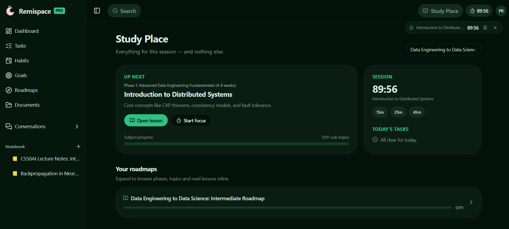
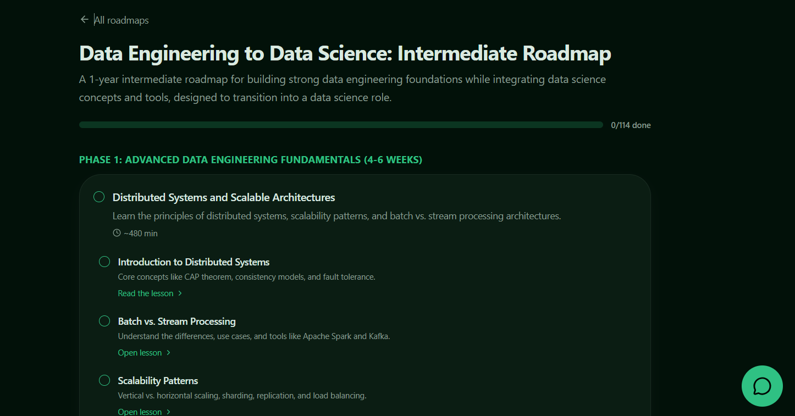
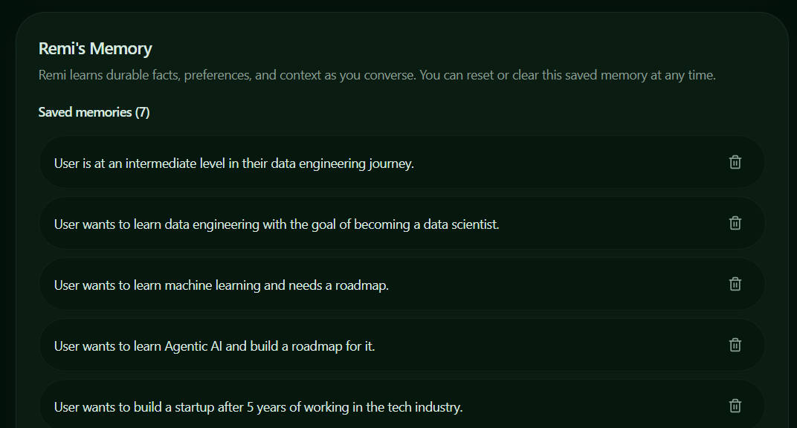
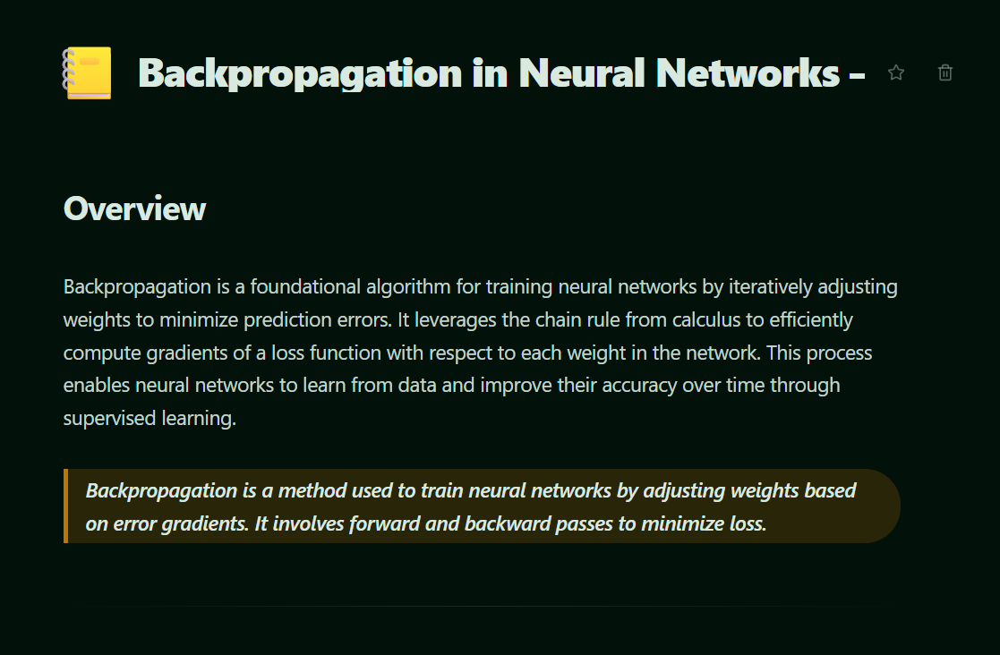
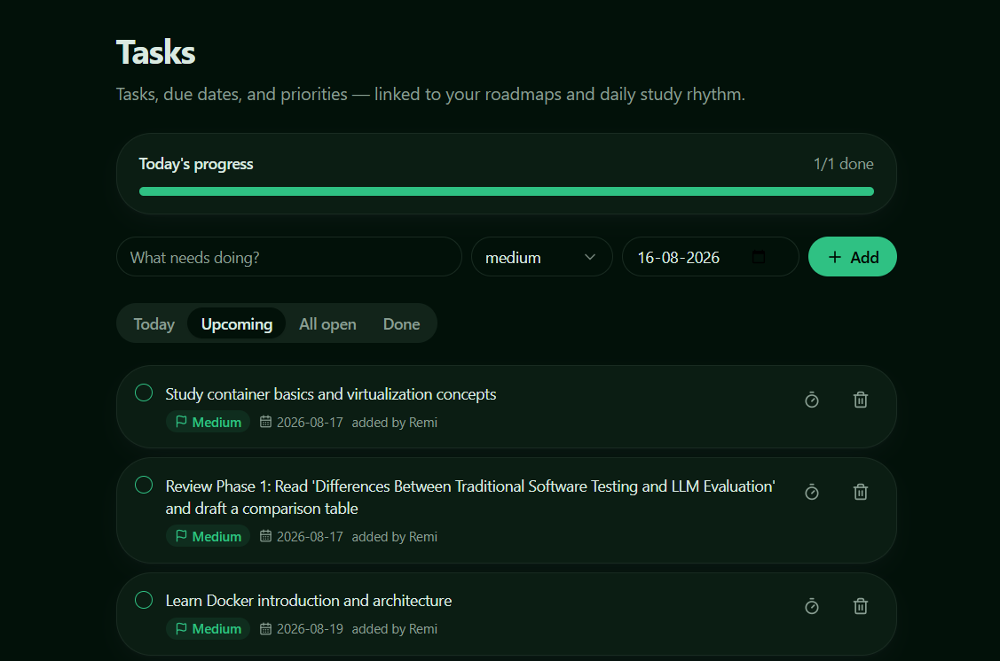
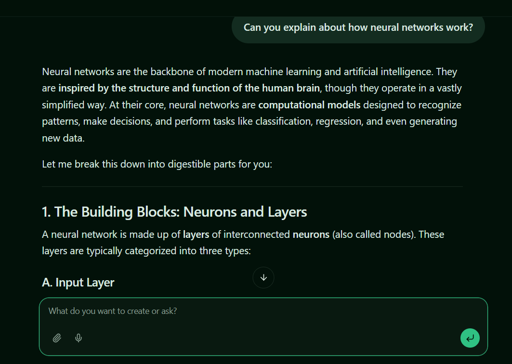
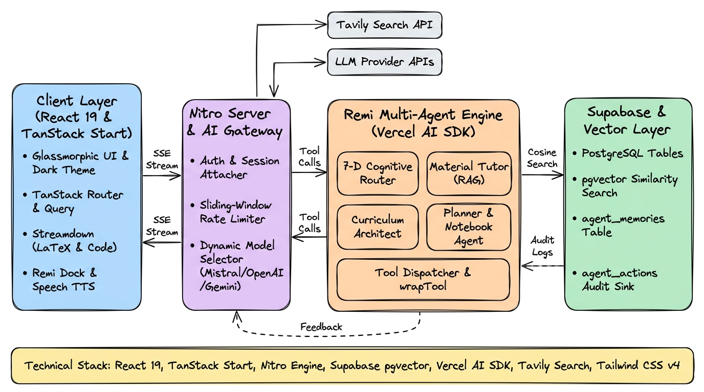
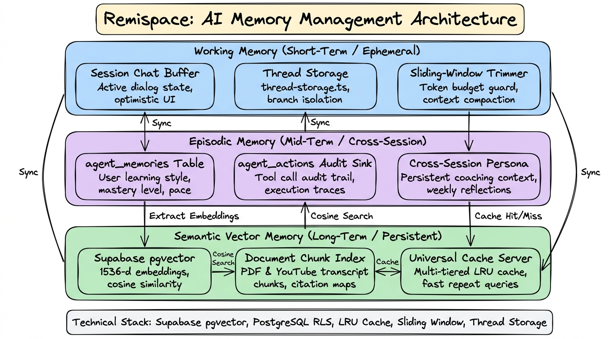
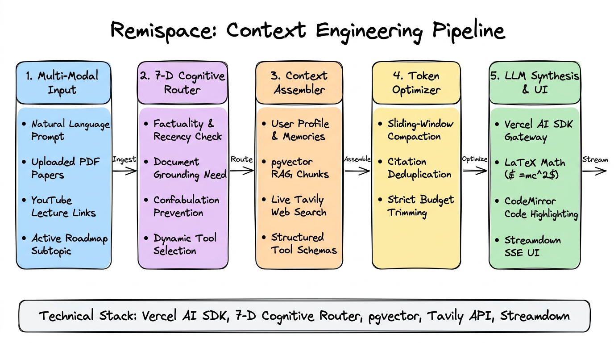

# Remispace

<div align="center">

[](https://react.dev/)
[](https://tanstack.com/router)
[](https://vitejs.dev/)
[](https://tailwindcss.com/)
[](https://supabase.com/)
[](https://sdk.vercel.ai/)
[](https://www.typescriptlang.org/)
[](https://www.remispace.in)

**The calm productivity workspace and AI learning companion for deep thinkers.**

Master complex disciplines with structured roadmaps, mathematical notebooks, grounded document intelligence, and Remi—your dedicated AI learning coach.

<br />

**Experience the live application:** [**www.remispace.in**](https://www.remispace.in)

<br />



<br />

[Try Remispace Live](https://www.remispace.in) • [Product Overview](#product-overview) • [Core Features](#core-product-features) • [System Architecture](#system-architecture) • [AI Memory Hierarchy](#ai-memory-hierarchy) • [Context Engineering](#context-engineering-pipeline) • [Pricing & Plans](#pricing--plans) • [Quickstart](#developer-quickstart)

</div>

---

## Table of Contents

- [Product Overview](#product-overview)
- [The Problem Remispace Solves](#the-problem-remispace-solves)
- [Core Product Features](#core-product-features)
  - [1. Structured AI Roadmaps & Curricula](#1-structured-ai-roadmaps--curricula)
  - [2. Grounded Document & Video Tutor (RAG)](#2-grounded-document--video-tutor-rag)
  - [3. Mathematical Block Notebook](#3-mathematical-block-notebook)
  - [4. Active Recall: Spaced Repetition & Quizzes](#4-active-recall-spaced-repetition--quizzes)
  - [5. Guilt-Free Habit Rings & Deep-Work Timers](#5-guilt-free-habit-rings--deep-work-timers)
  - [6. Remi: Multi-Agent AI Companion](#6-remi-multi-agent-ai-companion)
- [Product Architecture](#product-architecture)
  - [System Architecture Flow](#system-architecture-flow)
  - [AI Memory Hierarchy](#ai-memory-hierarchy)
  - [Context Engineering Pipeline](#context-engineering-pipeline)
  - [Multi-Agent Subsystem Matrix](#multi-agent-subsystem-matrix)
- [Technology Stack](#technology-stack)
- [Product Directory Map](#product-directory-map)
- [Pricing & Plans](#pricing--plans)
- [Developer Quickstart](#developer-quickstart)
- [Security, Privacy & Isolation](#security-privacy--isolation)

---

## Product Overview

Remispace is an all-in-one slow-productivity workspace and intelligent learning platform. It replaces fragmented study tools, noisy notification loops, and generic AI chatbots with a tranquil, glassmorphic sanctuary built specifically for deep work, technical comprehension, and lasting momentum.

At its core is **Remi**, a coordinated multi-agent AI system that deconstructs complex topics into structured syllabi, reads technical PDFs and video transcripts alongside you without hallucinating, and connects your daily execution directly to long-term mastery.

---

## The Problem Remispace Solves

| Traditional Productivity & Study Tools | The Remispace Product Experience |
| :--- | :--- |
| **Fragmented Systems**: Study materials (PDFs, lectures) live in one app, notes in a second, task lists in a third, and AI in a fourth. | **Unified Execution Hub**: Roadmaps, document tutors, math notebooks, tasks, habit rings, and focus timers reside in a single synchronized environment. |
| **Streak Anxiety & Burnout**: Harsh red badges, streak-shaming notifications, and penalty resets trigger psychological resistance. | **Slow Productivity & Guilt-Free Restarts**: Celebrates incremental progress. Missed a few days? Resume without penalty or negative reinforcement. |
| **Hallucinating AI Chatbots**: Generic models guess answers, fabricate citations, and lack persistent domain memory. | **7-D Grounded AI with pgvector**: Queries are evaluated across 7 cognitive dimensions. Searches the web via Tavily and cites exact document chunks. |

---

## Core Product Features

### 1. Structured AI Roadmaps & Curricula

Transform any topic—from *Quantum Computing* to *System Design*—into a multi-phase, step-by-step learning roadmap.

<div align="center">

</div>

- **Phase & Milestone Breakdown**: Hierarchical subtopics with estimated study durations and prerequisite mapping.
- **Interactive Lesson Generation**: Dynamic generation of structured lessons featuring syntax-highlighted code blocks (CodeMirror) and mathematical derivations.
- **Progress Tracking**: Visual completion meters and streak tracking tied to actual roadmap milestones.

---

### 2. Grounded Document & Video Tutor (RAG)

Upload academic papers, technical documentation, or YouTube lecture links for contextual analysis.

<div align="center">

</div>

- **Pre-Reading Briefs**: Instant summaries featuring core claims, time estimates, and a "Worth Your Time If" evaluation.
- **pgvector Semantic Search**: High-dimensional vector embeddings partitioned per user for fast similarity matching.
- **Verifiable Blockquoted Citations**: Answers cite exact sentences from your uploaded materials to prevent confabulation.

---

### 3. Mathematical Block Notebook

A distraction-free writing environment built for technical, scientific, and academic note-taking.

<div align="center">

</div>

- **Native KaTeX Support**: Render inline and display LaTeX mathematical formulas ($$\int_a^b f(x)dx$$).
- **CodeMirror Integration**: Multi-language code blocks with syntax highlighting and indentation.
- **Customizable Organization**: Structured callouts, task checklists, custom icons, and visual themes.

---

### 4. Active Recall: Spaced Repetition & Quizzes

Reinforce retention using proven cognitive science techniques generated on demand from your notes and reading materials.

- **Spaced Repetition System (SRS)**: Flashcards scheduled with the SuperMemo-2 (SM-2) algorithm based on your recall accuracy.
- **Diagnostic Assessment Quizzes**: Interactive multiple-choice and conceptual quizzes with comprehensive explanations for correct and incorrect answers.

---

### 5. Guilt-Free Habit Rings & Deep-Work Timers

Build sustainable routines that support long-term knowledge acquisition.

<div align="center">

</div>

- **Visual Progress Rings**: Track daily habits with smooth, responsive SVG completion rings.
- **Consistency Analytics**: 30-day and 365-day consistency heatmaps without streak-shaming resets.
- **Deep-Work Focus Timer**: Distraction-free Pomodoro and custom focus timers linked to specific roadmap items.
- **Mood Tracking**: Log daily mental well-being alongside productivity metrics.

---

### 6. Remi: Multi-Agent AI Companion

A team of specialized server subagents operating behind a unified chat and dock interface.

<div align="center">

</div>

- **Floating Dock & Sidebar**: Access Remi anywhere in the workspace without interrupting your active workflow.
- **Speech Synthesis (TTS)**: Built-in text-to-speech audio reader with selectable voices and adjustable playback speed.
- **Action Auditing**: All tool calls, memory saves, and roadmap modifications are logged to an audit sink for transparency.

---

## Product Architecture

### System Architecture Flow

<div align="center">

</div>

Remispace is built on a full-stack architecture utilizing **React 19** and **TanStack Start**:

- **Client Layer**: Single-page application built on React 19, TanStack Router for route-based code splitting, TanStack Query v5 for optimistic state management, and accessible Radix UI primitives.
- **Server Engine & API Gateway**: TanStack Start powered by Nitro Server Engine with typed server functions (`createServerFn`), session authentication attachers, and sliding-window rate limiting.
- **Remi AI Engine**: Orchestrator built on the Vercel AI SDK managing subagents, tool execution (`wrapTool`), and Server-Sent Event streaming via `streamdown`.
- **Database & Storage Layer**: Supabase PostgreSQL with Row-Level Security (RLS) policies, `pgvector` for semantic document retrieval, and persistent audit logs.
- **External Services**: Real-time web retrieval through the Tavily Search API and multi-provider LLM gateways (Mistral AI, OpenAI GPT-4o, Google Gemini, OpenRouter).

---

### AI Memory Hierarchy

<div align="center">

</div>

Remi utilizes a three-tiered memory architecture to maintain coherent context across conversations, sessions, and roadmaps:

| Memory Tier | Storage Mechanism | Functionality |
| :--- | :--- | :--- |
| **Working Memory (Short-Term)** | Session Buffer & `thread-storage.ts` | Retains immediate multi-turn conversational dialogue with sliding-window token trimming. |
| **Episodic Memory (Mid-Term)** | `agent_memories` Table & `agent_actions` Sink | Stores user learning style, pace, topic mastery, and tool invocation history across sessions. |
| **Semantic Vector Memory (Long-Term)** | Supabase `pgvector` & `universal-cache.server.ts` | 1536-dimensional embeddings of PDF chunks and transcripts with multi-tiered LRU caching. |

---

### Context Engineering Pipeline

<div align="center">

</div>

Queries pass through a 5-stage context engineering pipeline to guarantee factual grounding and low latency:

1. **Multi-Modal Input Ingestion**: Ingests user prompts, uploaded PDF documents, YouTube lecture links, and active roadmap context.
2. **7-Dimensional Intent Routing (`router.server.ts`)**: Evaluates query requirements across 7 cognitive dimensions (factuality, recency, document grounding, curriculum intent, task planning, active recall, note synthesis) to select optimal tools.
3. **Dynamic Context Assembly**: Combines the user persona, active roadmap state, relevant vector chunks (RAG), and live Tavily search results into a structured prompt schema.
4. **Token Budget Optimization**: Compresses context, deduplicates citations, and applies sliding-window trimming to fit model context windows efficiently.
5. **LLM Synthesis & Streaming Delivery**: Streams structured Markdown, inline/display LaTeX math formulas, and CodeMirror code blocks to the UI via Server-Sent Events (SSE).

---

### Multi-Agent Subsystem Matrix

| Subagent | File Path | Core Functionality |
| :--- | :--- | :--- |
| **Cognitive Router** | `src/lib/agents/router.server.ts` | Evaluates query requirements to determine whether web search, document RAG, or direct reasoning is necessary. |
| **Material Tutor** | `src/lib/agents/tutor.server.ts` | Performs vector search over document chunks and provides grounded answers with exact line citations. |
| **Curriculum Architect** | `src/lib/agents/curriculum.server.ts` | Creates multi-phase, structured learning roadmaps with subtopics, time estimates, and milestones. |
| **Web Researcher** | `src/lib/agents/research.server.ts` | Queries the Tavily Search API to retrieve verified, up-to-date documentation and external learning resources. |
| **Workspace Planner** | `src/lib/agents/planner.server.ts` | Converts study roadmaps into actionable tasks, habit routines, and milestone schedules. |
| **Notebook Synthesizer** | `src/lib/agents/notebook-agent.server.ts` | Transforms raw transcripts and concepts into block-structured notes with callouts and checklists. |
| **Flashcard Generator** | `src/lib/agents/flashcard-generator.server.ts` | Generates Spaced Repetition System (SRS) cards based on the SM-2 algorithm. |
| **Quiz Generator** | `src/lib/agents/quiz-generator.server.ts` | Creates multiple-choice and conceptual assessment quizzes with answer rationale. |

---

## Technology Stack

| Component | Technologies |
| :--- | :--- |
| **Frontend Framework** | React 19, TanStack Start, TanStack Router, TanStack Query v5 |
| **Styling & UI Components** | Tailwind CSS v4, Framer Motion, Radix UI Primitives, Lucide Icons |
| **AI Framework & Tooling** | Vercel AI SDK (`ai`), `@ai-sdk/mistral`, `@ai-sdk/openai-compatible` |
| **LLM Inference Gateways** | Mistral AI, OpenAI (GPT-4o), Google Gemini, OpenRouter |
| **Database & Vector Engine** | Supabase PostgreSQL + `pgvector` (cosine similarity search) |
| **Search & Document Parsing** | Tavily Search API, `pdfjs-dist` / `unpdf`, `youtube-caption-extractor` |
| **Rendering & Math Engine** | `streamdown` (Streaming Markdown & LaTeX), `@uiw/react-codemirror`, `shiki` |
| **Billing & Payments** | Razorpay Subscriptions & Webhook Listener |

---

## Product Directory Map

```
Remainderr/
├── src/
│   ├── routes/                         # TanStack Router file-based routes
│   │   ├── _authenticated/             # Protected application views
│   │   │   ├── dashboard.tsx           # Workspace home & daily overview
│   │   │   ├── study.tsx               # Active roadmaps & study hub
│   │   │   ├── roadmap.$roadmapId.tsx  # Interactive roadmap syllabus
│   │   │   ├── lesson.$itemId.tsx      # Subtopic lesson viewer
│   │   │   ├── library.tsx             # Document library
│   │   │   ├── material.$resourceId.tsx# Grounded document RAG workspace
│   │   │   ├── page.$pageId.tsx        # Mathematical block notebook
│   │   │   ├── habits.tsx              # Habit rings & consistency charts
│   │   │   ├── goals.tsx               # Goals & task management
│   │   │   ├── focus.tsx               # Deep-work focus timer & reflections
│   │   │   ├── pricing.tsx             # Subscription plans & billing
│   │   │   ├── activity.tsx            # AI agent audit & action logs
│   │   │   └── settings.tsx            # Profile & AI gateway settings
│   │   ├── api/                        # Backend Nitro API routes
│   │   │   ├── chat.ts                 # Main Remi chat streaming endpoint
│   │   │   ├── material-chat.ts        # Grounded document RAG endpoint
│   │   │   ├── upload-document.ts      # PDF upload & vector chunk processor
│   │   │   └── webhooks/razorpay.ts    # Razorpay subscription webhook handler
│   │   ├── auth.tsx                    # Authentication route (Sign in / Sign up)
│   │   ├── index.tsx                   # Public product landing page
│   │   └── __root.tsx                  # Root layout shell
│   ├── components/                     # Reusable UI component library
│   │   ├── ai-elements/                # Streaming messages, tool widgets, prompt input
│   │   ├── study/                      # PDF reader, video player, roadmap cards
│   │   ├── ui/                         # Accessible Radix UI components
│   │   ├── app-shell.tsx               # Navigation sidebar & responsive shell
│   │   ├── remi-chat.tsx               # Full Remi AI chat interface
│   │   ├── remi-dock.tsx               # Global dockable AI assistant
│   │   ├── flashcard-review.tsx        # Spaced repetition review modal
│   │   └── focus-timer.tsx             # Deep-work focus timer
│   ├── lib/
│   │   ├── agents/                     # Multi-agent server definitions
│   │   ├── chat-tools/                 # Vercel AI SDK tool call handlers
│   │   ├── ai-gateway.server.ts        # Dynamic multi-provider LLM selector
│   │   ├── document-processor.server.ts# PDF & transcript chunking engine
│   │   ├── embeddings.server.ts        # Vector embedding generation
│   │   ├── rate-limit.server.ts        # Sliding-window rate limiter
│   │   ├── srs.functions.ts            # Spaced repetition card scheduler
│   │   ├── tavily.server.ts            # Tavily web search integration
│   │   └── db.ts                       # Supabase client queries & mutations
│   ├── styles.css                      # Global styles & Tailwind CSS v4
│   └── router.tsx                      # TanStack Router instance
├── supabase/
│   └── migrations/                     # PostgreSQL schema, pgvector, and RLS
├── package.json                        # Node dependencies & npm scripts
├── vite.config.ts                      # Vite build configuration
└── tsconfig.json                       # TypeScript compiler options
```

---

## Pricing & Plans

| Plan | Pricing | Features Included |
| :--- | :--- | :--- |
| **Free Explorer** | Free Forever | Up to 3 Active Roadmaps, 5 PDF Uploads, Daily Habit Rings, Basic Remi Assistant. |
| **Pro Scholar (Weekly)** | INR 149 / week | Unlimited Roadmaps, Full pgvector Document RAG, Live Tavily Web Research, Full Flashcards & Quizzes. |
| **Pro Scholar (Monthly)** | INR 499 / month | All Pro features, Priority AI Inference, Custom Theme Overrides, Extended Context Windows. |

*Billing is handled via secure Razorpay checkout with automatic tier activation and webhook synchronization.*

---

## Developer Quickstart

### Prerequisites
- **Node.js**: `v20.0.0` or higher
- **Package Manager**: `npm`, `pnpm`, or `bun`
- **Supabase Account**: PostgreSQL database with `pgvector` enabled

### 1. Installation
```bash
npm install
```

### 2. Environment Configuration
Create a `.env` file in the project directory:

```env
# Supabase Database & Auth (Required)
SUPABASE_PROJECT_ID="your-project-id"
SUPABASE_PUBLISHABLE_KEY="your-publishable-key"
SUPABASE_URL="https://your-project-id.supabase.co"
SUPABASE_SERVICE_ROLE_KEY="your-service-role-key"

# AI Provider API Keys (Configure at least one)
MISTRAL_API_KEY="your-mistral-api-key"
MISTRAL_MODEL="mistral-small-latest"

OPENAI_API_KEY="your-openai-api-key"
OPENAI_MODEL="gpt-4o"

GEMINI_API_KEY="your-gemini-api-key"
OPENROUTER_API_KEY="your-openrouter-key"

# Web Research (Required for Tavily search agent)
TAVILY_API_KEY="your-tavily-api-key"

# Razorpay Payments (Optional)
RAZORPAY_KEY_ID="rzp_test_your_key_id"
RAZORPAY_KEY_SECRET="your_razorpay_secret"
RAZORPAY_WEBHOOK_SECRET="your_webhook_secret"
```

### 3. Apply Database Migrations
Run the SQL migration scripts in `supabase/migrations/` inside your Supabase SQL Editor.

### 4. Run Development Server
```bash
npm run dev
```
Open [http://localhost:3000](http://localhost:3000) in your browser.

### 5. Build for Production
```bash
npm run build
npm run preview
```

---

## Security, Privacy & Isolation

- **Row-Level Security (RLS)**: Enforced across all PostgreSQL tables, guaranteeing that every user's roadmaps, notes, documents, and habits are strictly isolated.
- **Isolated Vector Store**: Document embeddings, extracted text chunks, and search indexes are partitioned by user ID.
- **Audited AI Tool Execution**: Every AI agent tool call is recorded in the `agent_actions` table with caller parameters, timestamps, and execution outcomes.

---

<div align="center">

*Progress isn't measured by how fast you sprint, but by the quiet consistency of showing up.*

**Start learning with clarity at [www.remispace.in](https://www.remispace.in)**

</div>
